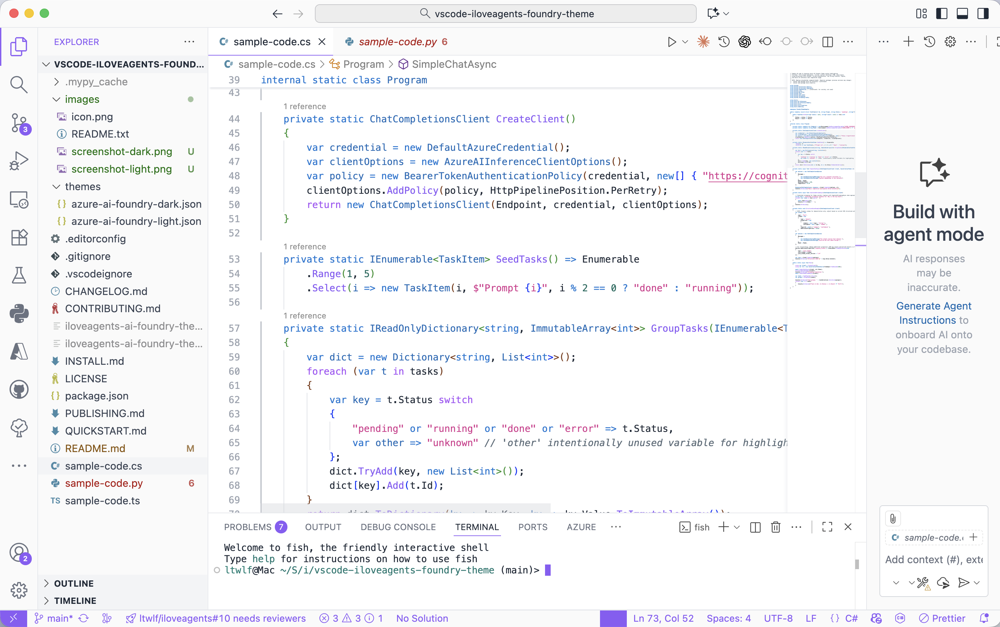
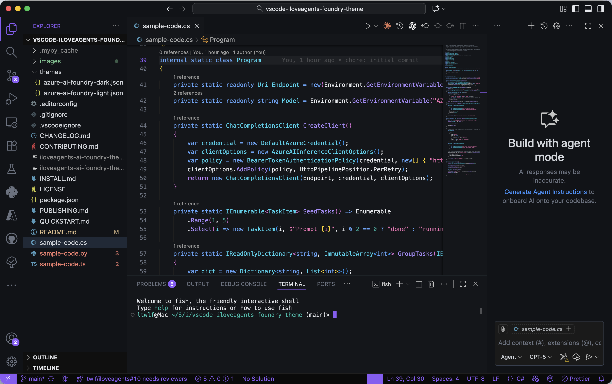

# iLoveAgents – Azure AI Foundry Theme

Modern Azure AI Foundry + Agent Framework dark & light theme for focused agent development. Purposeful purple (functions), Azure blue (structure), teal (success & diagnostics).

**Why**: Faster iteration (and simply more fun) while building tools, prompts, evaluation flows, and multi‑agent orchestration on Azure AI Foundry + the Microsoft Agent Framework.

**Highlights**
• Azure AI Foundry aligned palette (purple • azure • teal)  
• Agent Framework friendly (function + tool call clarity)  
• Distinct semantics: keywords azure, functions purple, strings pink, numbers cool‑teal  
• Tuned terminal ANSI (teal success; clearer red/yellow)  
• Low color noise → longer, less fatiguing sessions  

**Palette (Dark / Light)** Keywords `#0078d4 / #60a5fa` • Functions `#8b5cf6 / #a78bfa` • Strings `#d7368f / #f472b6` • Numbers `#046b5f / #11a194` • Success `#0d766e / #14b8a6` • Error `#d92c3a / #f87171`

**Install**: Extensions View → search “iLoveAgents AI Foundry” → choose Dark or Light.

Docs & agent patterns: <https://iloveagents.ai>

## Screenshots

Light: 

Dark: 

---

## More Details (Repository Only)

Extended design principles, configuration tips, roadmap & contribution guidelines are kept for repository browsing.

### Design Principles

1. Reduce cognitive color switching  
2. Preserve structure cues without glare  
3. Keep functions visually findable  
4. Pleasant success / healthy state signaling  
5. Sustain long-session comfort  

### Configuration (Optional)

```jsonc
{
  "editor.bracketPairColorization.enabled": false,
  "editor.semanticHighlighting.enabled": true,
  "workbench.preferredDarkColorTheme": "iLoveAgents - AI Foundry Dark",
  "workbench.preferredLightColorTheme": "iLoveAgents - AI Foundry Light"
}
```

### Contributing

Issues & improvements welcome: <https://github.com/iLoveAgents/vscode-iloveagents-foundry-theme>

### License

MIT. Not affiliated with Microsoft; “Azure” & related names are trademarks of Microsoft.

Enjoy & build great agents! 💙
