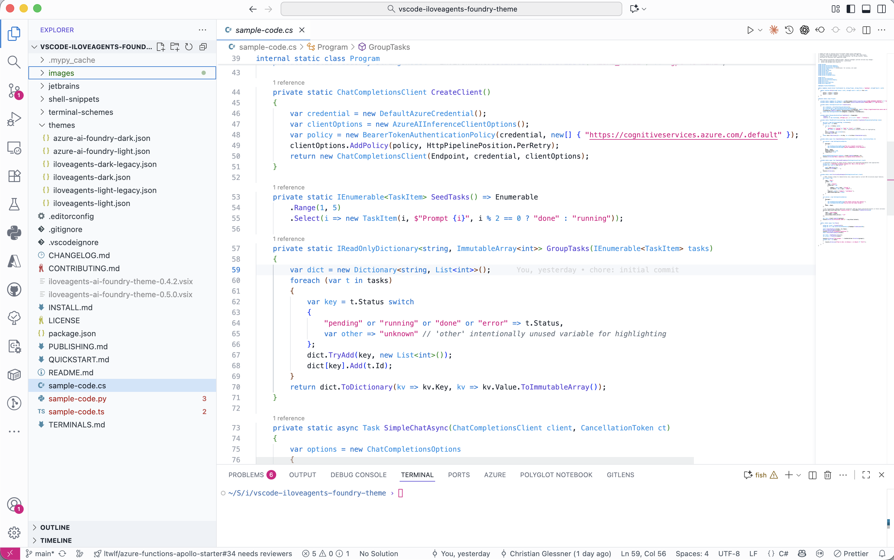
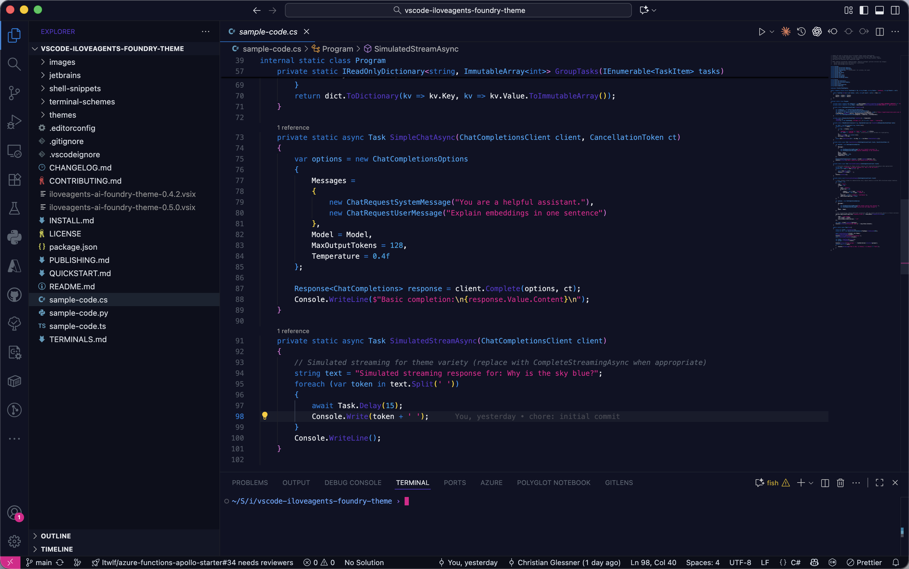

# iLoveAgents - Azure AI Foundry Themes

Professional color themes for developers - choose between vibrant classic or modern Azure AI Foundry palettes.

**Two Theme Families:**

🎨 **iLoveAgents - Dark/Light** (Classic)  
Vibrant purple-teal palette with high energy. Functions in purple `#8b5cf6`, success in teal `#14b8a6`, strings in pink `#f472b6`.

🌐 **iLoveAgents - Azure AI Foundry Dark/Light**  
Logo-coherent modern palette optimized for Azure AI development. Functions in indigo `#5637C9`, keywords in azure `#0078D4`, strings in magenta `#E3008C`, numbers in cyan `#1AA4E8`.

**Highlights**
• Four complete themes: classic + Azure AI Foundry variants in dark/light  
• Agent Framework friendly (function + tool call clarity)  
• Distinct semantics: clear visual hierarchy for code elements  
• Matching terminal schemes (Ghostty, Kitty, Alacritty, WezTerm, iTerm2, Windows Terminal)  
• JetBrains variants available (IntelliJ, PyCharm, etc.)  
• Low color noise → longer, less fatiguing sessions  

**Azure AI Foundry Palette (Dark / Light)**  
Keywords `#0078D4` • Functions `#5637C9 / #5D4BD8` • Strings `#E3008C / #D90082` • Numbers `#1AA4E8 / #008FD8` • Success `#0FA8A0 / #079A93` • Error `#E84855 / #D92C3A` • Background `#101224 / #FFFFFF`

**Classic Palette (Dark / Light)**  
Functions `#8b5cf6` • Keywords `#60a5fa` • Strings `#f472b6 / #d7368f` • Numbers/Success `#14b8a6 / #0d766e` • Error `#f87171 / #d92c3a` • Background `#14161a / #ffffff`

**Install**: Extensions View → search "iLoveAgents Themes" → choose your preferred variant.

Docs & agent patterns: <https://iloveagents.ai>

## Screenshots

iLoveAgents - Azure AI Foundry Light: 

iLoveAgents - Light: 

iLoveAgents - Azure AI Foundry Dark: 

iLoveAgents - Dark: 

---

## More Details (Repository Only)

Extended design principles, configuration tips, roadmap & contribution guidelines are kept for repository browsing.

### Design Principles

1. Reduce cognitive color switching  
2. Preserve structure cues without glare  
3. Keep functions visually findable  
4. Pleasant success / healthy state signaling  
5. Sustain long-session comfort  

### Configuration (Optional)

```jsonc
{
  "editor.bracketPairColorization.enabled": false,
  "editor.semanticHighlighting.enabled": true,
  "workbench.preferredDarkColorTheme": "iLoveAgents - Azure AI Foundry Dark",
  "workbench.preferredLightColorTheme": "iLoveAgents - Azure AI Foundry Light"
}
```

### Terminals & Shells

Want matching Ghostty / fish (prompt + colors) or other terminal schemes? See `TERMINALS.md` (bundled in the extension).

Fast path (fish + Ghostty only) from repo root:

```fish
fish shell-snippets/setup-fish-ghostty.fish
```

This single script handles fish colors, prompt, and Ghostty theme reference. Everything else in `shell-snippets/` and `terminal-schemes/` is optional.

### Included Extras

The extension package includes these helper assets for a cohesive environment:

```text
terminal-schemes/   # Windows Terminal, iTerm2, Ghostty, Alacritty, Kitty, WezTerm palettes
shell-snippets/     # setup-fish-ghostty.fish, enhanced fish prompt, zsh & PowerShell snippets
TERMINALS.md        # Detailed instructions & quick start
sample-code.*       # Small language samples to preview syntax coloring
```

JetBrains theme variants live only in the repository (`jetbrains/`) and are not part of the VS Code extension.

### Contributing

Issues & improvements welcome: <https://github.com/iLoveAgents/vscode-iloveagents-foundry-theme>

### License

MIT. Not affiliated with Microsoft; "Azure" & related names are trademarks of Microsoft.

Enjoy & build great agents! 💙
